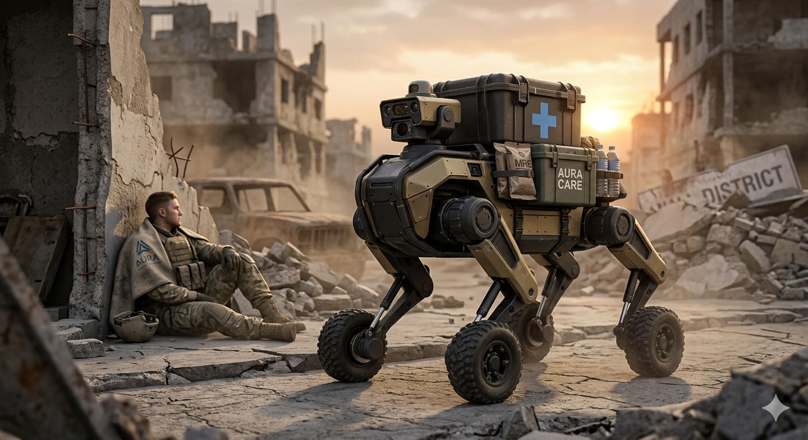

# AURA-MARS: Mobile Adaptive Rescue System
> **"Saving lives where wheels can't roll and hearts shouldn't be put at risk."**

AURA-MARS is a tactical, non-combatant **Multi-Agent Hybrid Robot** designed to navigate disaster zones and high-risk environments. It focuses on **Supply Logistics** (Medicine/Food) and **Battlefield Evacuation Support**.

---

## 🚀 The Mission: Mobility & Preservation
AURA-MARS is built to reduce human casualties by taking over high-risk delivery tasks. It does not carry weapons; it carries **hope** in the form of bandages, water, and shelter.

### Key Capabilities:
- **Leg-Wheel Hybrid Locomotion:** High-speed wheeled movement on flat surfaces; quadrupedal walking for rubble, stairs, and trenches.
- **Autonomous Supply Chain:** Real-time inventory tracking for emergency medical kits and rations.
- **Defensive Shielding:** Intelligent positioning to act as a mobile ballistic shield for wounded personnel.

## 🧠 Tactical Agents
1. **Locomotion Agent (Hybrid-Gait):** Dynamically switches between rolling and stepping modes based on terrain roughness.
2. **Resupply Agent:** Manages the payload bay, ensuring critical medicine is accessible even in low-visibility conditions.
3. **Guardian Agent:** Uses LiDAR and Thermal sensors to identify wounded allies and position itself as a barrier against environmental hazards.

## 🛠 Technical Focus
- **Framework:** ROS 2 / MoveIt for limb coordination.
- **Sensors:** Thermal IR (Human detection), 360-degree LiDAR (Mapping), and IMU (Stability).
- **Material:** Lightweight Ceramic/Kevlar composite for the cargo chassis.

## 🤝 Open Call
I am sharing this conceptual framework for those interested in **Quadruped Robotics**, **Tactical Logistics**, and **Humanitarian Engineering**. This is a small-scale prototype design with a large-scale mission: *To ensure that no one is left behind because the terrain was too difficult.*

---
*Status: Conceptual Design. Focused on Leg-Wheel Kinematics.*
